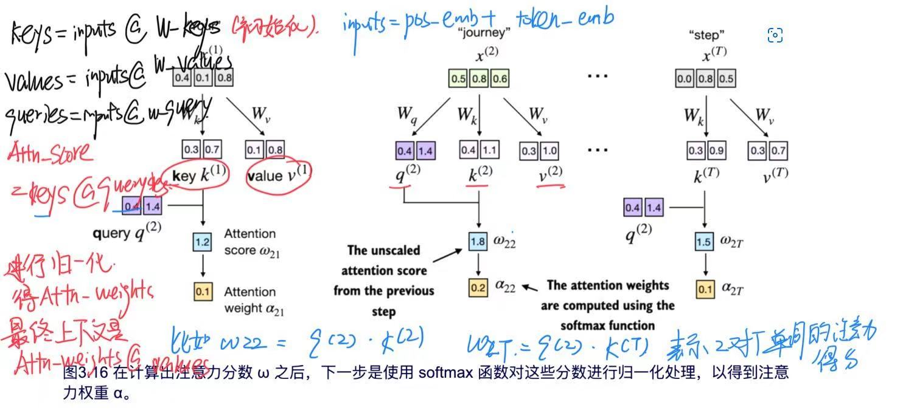

# build-a-llm-from-scratch 从零构建大语言模型

学习路径来自[
Build a Large Language Model (From Scratch) 中文版](https://skindhu.github.io/Build-A-Large-Language-Model-CN/#/)以及[Build a Large Language Model (From Scratch)](https://github.com/rasbt/LLMs-from-scratch/tree/main)

# 学习内容
### 0. [个人笔记](从零构建大模型.pdf)
### 1. 理解大语言模型
### 2. 处理文本数据
1. 将文本embedding化，即向量化
2. 可以使用gpt2的分词器，或者手写分词器，其中分词器实现的主要原理是bpe算法
3. 为了让llm理解文字位置，加入位置编码
4. 最终一个文本text最后转化为 text_embedding+position_embedding
### 3. 实现注意力机制
1. 注意力的重要性是为了让LLM能管住全部的词，不会因为前后词的距离而忘记，要重点看重之间的注意力
2. 自注意力机制的重点在于三个向量Q、K、V,
    1. query(查询向量代表了这个词在寻找相关信息时提出的问题)
    2. key(键向量代表了一个单词的特征，或者说是这个单词如何"展示"自己，以便其它单词可以与它进行匹配)
    3. value(值向量携带的是这个单词的具体信息，也就是当一个单词被"注意到"时，它提供给关注者的内容)
</p> 

3. 理解方式
4. 将得到的注意力得分进行归一化
5. 使用for循环计算所有的上下文向量，获得所有的注意力得分(也要进行归一化)
6. 大致计算过程
7. 大致代码内容，但是实际要与矩阵的参数结合(batch, num_tokens, num_heads, head_dim)
    ```
    W_query = torch.nn.Parameter(torch.rand(d_in, d_out), requires_grad=False)
    W_key   = torch.nn.Parameter(torch.rand(d_in, d_out), requires_grad=False)
    W_value = torch.nn.Parameter(torch.rand(d_in, d_out), requires_grad=False)
    
    keys = inputs @ W_key
    values = inputs @ W_value
    queries = inputs @ W_query

    attn_scores = values @ keys
    attn_weigths = softmax(...)

    context_vec = attn_weights @ values
8. 完整图例

9. 使用-INF 屏蔽后续词以及增加dropout来防止过拟合
### 4. 从零开始实现用于文本生成的GPT模型
1. LayNorm层,将数据以N(0,1)的正态分布，来标准化数据
2. GELU层,激活函数，比ReLu更加平滑
3. FeedForward层，由Linear,GeLU,Linear 组成,实现数据的解压再收缩
4. 快捷连接,用于减少梯度消失,在dropout后增加部分的原数据 Output = Xn+F(Xn),n层输出不仅有原来的输入还有处理后的Xn数据
5. 注意力Transformer代码块
    ```
    def forward(self, x):
    shortcut = x                                          #快捷连接记录原数据
    x = self.norm1(x)
    x = self.att(x)                                       #多头注意力实现，类似于3.7
    x = self.drop_shortcut(x)
    x = x + shortcut  # Add the original input back
    shortcut = x                                          
    x = self.norm2(x)
    x = self.ff(x)                                        #前端反馈层
    x = self.drop_shortcut(x)
    x = x + shortcut                                      
    return x
6. 完整GPT Model结构,中间有12个上述的transformer块，以及最后的layerNorm和output

7. 
    1. 生成文本的原理，在每次logits输出后，只需要关注最后一个输出的数据是由50256维度的向量，其中把每个数字进行softmax便是下一个单词生成的概率，之后再获得最大概率的单词就是model预测的下一个单词,将新的单词加入文本后继续使用model输出，知道最大token数
    2. 生成文本的其他方法，引入temperuate计算 scaled_logits = logits / temperature，在进行选择最大的概率的logits
    3. top-k采样，即先取前k个最有可能的的token后，将其他概率清零，再结合temperuate进行计算
### 5. 在无标记数据集进行预训练
1. 评估生成出来的文本效果，可以来个input和target
    ```
    def calc_loss_batch(input_batch, target_batch, model, device):
    input_batch = input_batch.to(device)
    target_batch =target_batch.to(device)

    logits = model(input_batch)   #target即使input_token的下一个token，logits则是model计算出来的下一个token，二者计算entropy
    loss =torch.nn.functional.cross_entropy(
        logits.flatten(0,1),target_batch.flatten()
    )  #logits.shape = batch*num,vocab_size,表示每个单词的概率 , target.shape 是batch*num，其中是正确索引的数量，而这进行-log计算
    return loss

2. 训练模型 
    1. 划分数据集 0.7,0.2,0.1 大致
    2. 对数据进行dataloader 处理
    3. 对每个epoch中的每个batch，清空原本损失梯度，计算当前的损失，使用backward反向传播，修改权重
    4. 在固定更新后，进行loss模型评估，生成文字查看效果
3. 保存模型以及加载模型

### 6. 用于分类任务的微调
主要重要点就是将最后的输出结果设置为2维，二分类，之后可以选择性的封锁部分的权重不更新，因为前面部分是为了让ai理解文字生成，就后面一些是为了让ai识别垃圾短信
### 7. 指令遵循微调
主要重点是数据集的要求是指令模式，有固定的格式要求，并且要根据output结果和原本的output进行计算交叉熵loss，来更新权重
